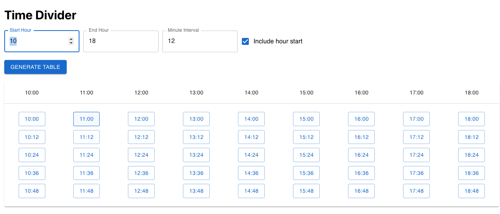

# ReactHourSplitter



## Overview

The **ReactHourSplitter** is a web-based tool that helps users generate time slots between specified start and end hours, with customizable minute intervals. The generated slots can be used for scheduling, planning, or any application where time segmentation is needed.

## Features

- **Customizable Time Range:** Specify the start and end hours to generate time slots within a desired period.
- **Flexible Minute Intervals:** Set the interval in minutes to define the granularity of the time slots.
- **Include Hour Start Option:** Optionally include the exact hour in the generated time slots.
- **Interactive UI:** Users can select a time slot, and a popup will display the selected time.

## Usage

1. **Set Start and End Hours:** 
   - Use the `Start Hour` and `End Hour` input fields to define the time range.
   
2. **Set Minute Interval:**
   - Define the time slot intervals using the `Minute Interval` input field.

3. **Include Hour Start:**
   - Check the `Include hour start` box if you want the slots to include the start of each hour (e.g., 10:00, 11:00).

4. **Generate Time Slots:**
   - Click the `Generate Table` button to create the table of time slots based on the inputs.

5. **Select a Time Slot:**
   - Click on any generated time slot to display the selected time in a popup.

## Installation

To run this project locally:

1. Clone the repository:
   ```bash
   git clone https://github.com/akkayaberkin/hoursplitter.git

2. Navigate to the project directory:
   ```bash
   cd hoursplitter
3. Install dependencies:
   ```bash
    npm install
4. Start the development server:
   ```bash
    npm start
